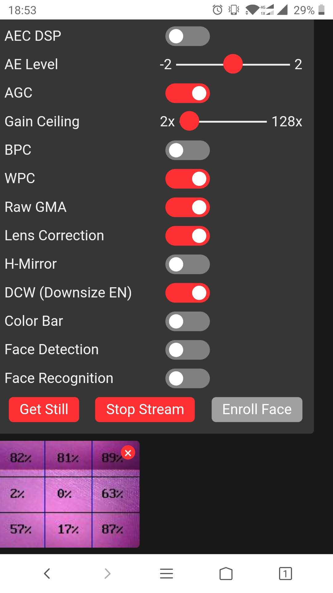

# Applications-cam

## 1. M5CamColorRecognition

### (1) English illustration

**Function:** M5Camera ( A Model ) red color recognition

**Operation:** Aften burn this firmware to M5Camera, connect to a AP named "LidarBot: <MAC address>" ( likes "LidarBot:B4:E6:2D:9C:5F:19" ) generated by M5Camera using your phone. If you can connect the AP successfully, access this URL `192.168.4.1`.

### (2) 中文说明

**程序功能：** M5Camera ( A Model ) 红色颜色识别

**操作：** 烧录了程序之后，手机或电脑连接热点 "LidarBot:"+ MAC地址，如 "LidarBot:B4:E6:2D:9C:5F:19"，成功连接之后，在浏览器上访问地址 `192.168.4.1`

### (3) Result / 效果图

